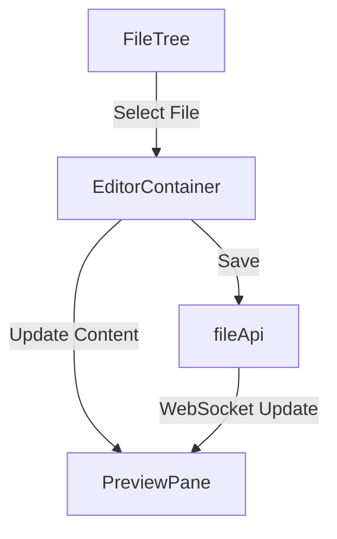
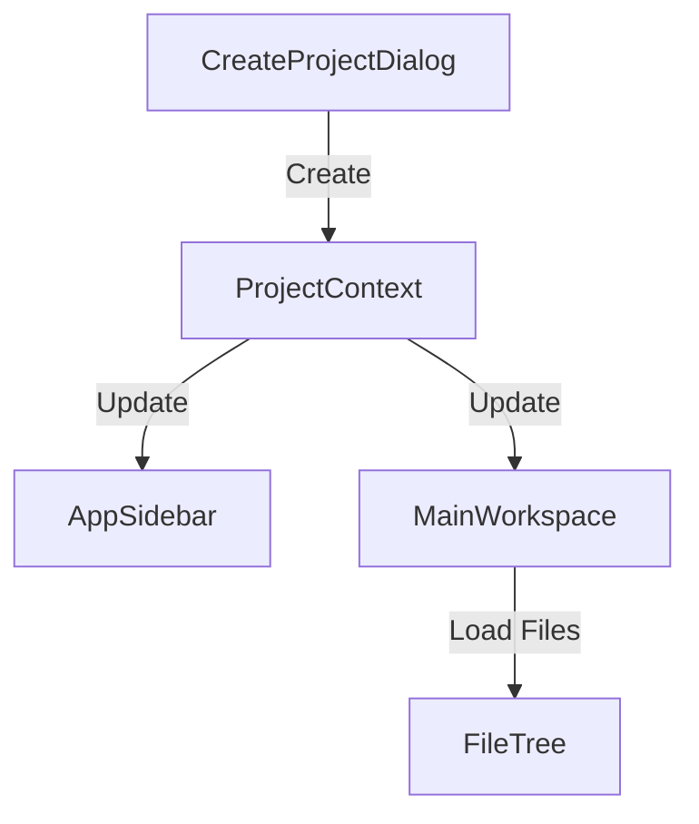
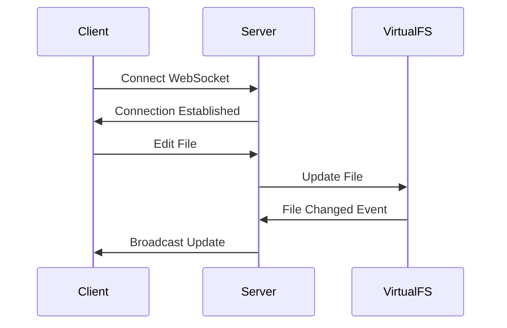
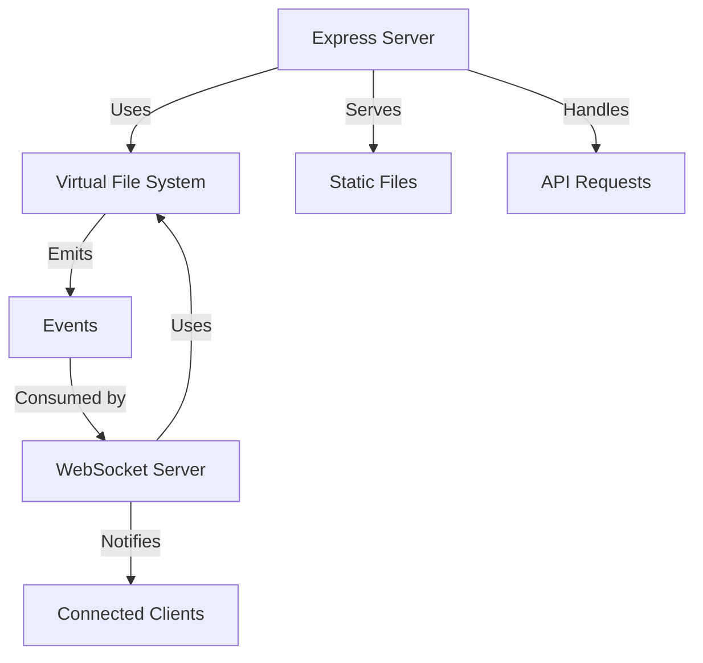
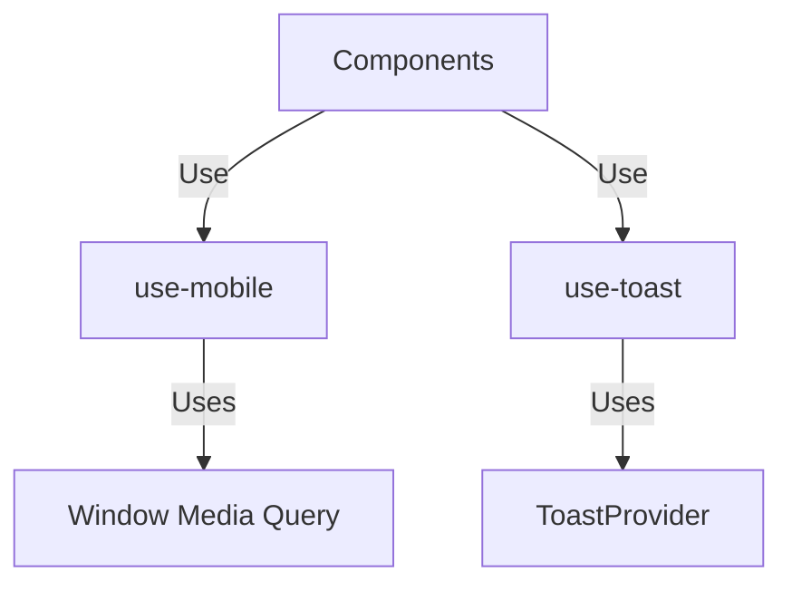

# Project Analysis - aiuxpot

## Project Overview
aiuxpot is an AI-powered UX design platform that allows developers to create and manage design projects with integrated AI capabilities. The platform runs locally, ensuring data privacy and control.

## Project Structure
```
src/
├── components/    # React components
├── contexts/     # React context providers
├── hooks/        # Custom React hooks
├── lib/          # Utility libraries
├── pages/        # Page components
├── types/        # TypeScript type definitions
├── utils/        # Utility functions
├── App.tsx       # Main application component
├── main.tsx      # Application entry point
└── index.css     # Global styles
```

## Core Files Analysis

### 1. Entry Points

#### `src/main.tsx`
**Purpose**: Application entry point that initializes the React application.
**Exports**: None
**Dependencies**:
- react-dom
- App.tsx
- index.css

**Key Functionality**:
- Renders the root App component into the DOM
- Sets up the root element for React rendering

#### `src/App.tsx`
**Purpose**: Main application component that sets up routing and global providers.
**Type**: React Functional Component
**Dependencies**:
- @tanstack/react-query
- react-router-dom
- Various internal components and providers

**Key Components**:
```typescript
const App = () => (
  <ErrorBoundary>
    <QueryClientProvider>
      <ThemeProvider>
        <ProjectProvider>
          <TooltipProvider>
            <Router>
              <Routes>
                <Route path="/" element={<Index />} />
                <Route path="/design/:projectId" element={<Design />} />
                <Route path="/test-design/:projectId" element={<TestDesign />} />
              </Routes>
            </Router>
          </TooltipProvider>
        </ProjectProvider>
      </ThemeProvider>
    </QueryClientProvider>
  </ErrorBoundary>
)
```

**Key Features**:
- Global error boundary for error handling
- React Query for data fetching
- Theme provider for consistent styling
- Project context for managing project state
- Routing setup with react-router-dom

### 2. Core Contexts

#### `src/contexts/ProjectContext.tsx`
**Purpose**: Manages project state and operations across the application.
**Exports**:
- `ProjectProvider`: React Context Provider
- `useProject`: Custom hook for accessing project context

**Key Interfaces**:
```typescript
interface ProjectContextType {
  projects: Project[];
  currentProject: Project | null;
  setProjects: (projects: Project[]) => void;
  setCurrentProject: (project: Project | null) => void;
  addProject: (title: string, description: string) => Promise<Project>;
  deleteProject: (id: string) => Promise<void>;
}
```

**State Management**:
- Maintains list of projects
- Tracks current active project
- Handles project CRUD operations
- Syncs with localStorage and backend

### 3. Core Utilities

#### `src/utils/fileApi.ts`
**Purpose**: Handles file operations and caching.
**Exports**:
- `fileApi`: Singleton instance for file operations

**Key Features**:
- File content caching
- Project-specific file operations
- WebSocket integration for real-time updates

#### `src/utils/previewApi.ts`
**Purpose**: Manages preview functionality and WebSocket connections.
**Exports**:
- `previewApi`: Singleton instance for preview operations

**Key Features**:
- Real-time file preview updates
- WebSocket connection management
- Project state synchronization

## Component Analysis

### Core Components

#### `src/components/CodeEditor/`
**Purpose**: Main code editing functionality
**Key Components**:
- `EditorContainer.tsx`: Main container managing editor state and file operations
- `FileTree.tsx`: File explorer component
- `TabsManager.tsx`: Manages editor tabs

**State Management**:
- Editor pane state
- Open files and tabs
- File tree state
- Unsaved changes tracking

#### `src/components/AppSidebar.tsx`
**Purpose**: Main application sidebar
**Type**: React Functional Component
**Props**:
```typescript
interface AppSidebarProps {
  className?: string;
}
```
**Features**:
- Project navigation
- Theme toggle
- User settings access

#### `src/components/CreateProjectDialog.tsx`
**Purpose**: Dialog for creating new projects
**Type**: React Functional Component
**Key Features**:
- Project title and description inputs
- Form validation
- Project creation handling
- Error feedback

#### `src/components/ErrorBoundary.tsx`
**Purpose**: Global error handling component
**Type**: React Class Component
**Features**:
- Catches and displays runtime errors
- Error reporting
- Fallback UI
- Error recovery options

#### `src/components/MainWorkspace.tsx`
**Purpose**: Main workspace layout component
**Type**: React Functional Component
**Layout Sections**:
- Code editor
- Preview pane
- File explorer
- Toolbar

#### `src/components/PreviewPane/`
**Purpose**: Real-time preview functionality
**Key Features**:
- Live preview rendering
- Preview synchronization
- Device frame options
- Zoom controls

#### `src/components/ui/`
**Purpose**: Reusable UI components based on shadcn/ui
**Key Components**:
- Button
- Dialog
- Dropdown
- Input
- Toast
- Tooltip
- Card
- etc.

### Component Interactions

#### File Editing Flow


#### Project Management Flow


### State Management Patterns

1. **File State**
   - Managed by EditorContainer
   - Cached in fileApi
   - Synced via WebSocket

2. **Project State**
   - Managed by ProjectContext
   - Persisted in localStorage
   - Synced with server

3. **UI State**
   - Theme: ThemeProvider
   - Toasts: ToastProvider
   - Tooltips: TooltipProvider

### Error Handling Strategy

1. **Component-Level**
   - try/catch blocks
   - Error state management
   - User feedback via toasts

2. **Application-Level**
   - ErrorBoundary component
   - Global error handling
   - Error recovery options

### Performance Considerations

1. **Code Splitting**
   - Lazy loaded components
   - Dynamic imports for heavy modules

2. **Caching**
   - File content caching
   - Project data caching
   - Preview caching

3. **Optimization**
   - Debounced updates
   - Memoized components
   - Virtual scrolling for large files

## File System Implementation

#### Components

##### `src/components/file-tree/file-tree.tsx`
**Purpose**: Renders a hierarchical tree view of files and directories.
**Type**: React Functional Component
**Dependencies**:
- lucide-react (icons)
- @/contexts/filesystem-context
- @/components/ui/*

**Key Features**:
- Expandable/collapsible directory nodes
- File/directory selection
- Visual indicators for files and directories
- Indentation based on hierarchy level

##### `src/components/file-pane.tsx`
**Purpose**: Main file explorer component with file operations UI.
**Type**: React Functional Component
**Dependencies**:
- @/contexts/filesystem-context
- @/components/file-tree/file-tree
- @/components/ui/*

**Key Features**:
- File/directory creation dialog
- File system navigation
- File operations menu

#### Context and State Management

##### `src/contexts/filesystem-context.tsx`
**Purpose**: Provides file system state and operations to components.
**Type**: React Context Provider
**Dependencies**:
- @/types/filesystem
- @/reducers/filesystem-reducer
- @/lib/filesystem/filesystem-service

**Key Features**:
- File system state management
- File operation methods (create, delete, rename, move)
- Node expansion/selection state
- Integration with file system service

#### Types and Interfaces

##### `src/types/filesystem.ts`
**Purpose**: TypeScript definitions for file system entities and operations.
**Key Types**:
```typescript
interface FileSystemNode {
  id: string;
  name: string;
  path: string;
  type: 'file' | 'directory';
  children?: FileSystemNode[];
  parent?: string;
  metadata?: {
    size?: number;
    modified?: Date;
    created?: Date;
    extension?: string;
  };
}

interface FileSystemState {
  root: FileSystemNode;
  expandedNodes: Set<string>;
  selectedNode?: string;
}
```

#### Services

##### `src/lib/filesystem/filesystem-service.ts`
**Purpose**: Handles file system operations and persistence.
**Type**: Singleton Service Class
**Key Features**:
- File system initialization
- File/directory CRUD operations
- Path management
- File metadata handling

#### State Management

##### `src/reducers/filesystem-reducer.ts`
**Purpose**: Manages file system state updates.
**Type**: Redux-style Reducer
**Key Actions**:
- SET_ROOT: Initialize file system
- TOGGLE_NODE: Expand/collapse directories
- SELECT_NODE: Select files/directories
- ADD_NODE: Create new files/directories
- DELETE_NODE: Remove files/directories
- RENAME_NODE: Rename files/directories
- MOVE_NODE: Move files/directories

## Server Architecture

### Overview
The server component provides file management, real-time updates, and preview functionality through Express.js and WebSocket servers.

### Key Components

#### 1. `server/fileServer.ts`
**Purpose**: Main file server implementation
**Key Classes**:
```typescript
class FileServer {
  private app: express.Express;
  private wss: WebSocketServer;
  private vfs: VirtualFileSystem;
  private clients: Set<WebSocket>;
}
```

**Key Features**:
- REST API endpoints for file operations
- WebSocket server for real-time updates
- File content serving
- Project management

**API Endpoints**:
```typescript
// Project endpoints
POST   /projects                 // Create project
GET    /projects                 // List projects
DELETE /projects/:id             // Delete project

// File endpoints
GET    /projects/:id/files       // List files
GET    /projects/:id/files/*     // Get file content
POST   /projects/:id/files/*     // Create/update file
DELETE /projects/:id/files/*     // Delete file
```

#### 2. `server/virtualFs.ts`
**Purpose**: Virtual file system implementation
**Key Classes**:
```typescript
class VirtualFileSystem extends EventEmitter {
  private projects: Map<string, Project>;
}

interface Project {
  id: string;
  name: string;
  files: Map<string, VirtualFile>;
  createdAt: Date;
  updatedAt: Date;
}

interface VirtualFile {
  content: string;
  type: string;
}
```

**Key Features**:
- In-memory file system
- Project isolation
- File type handling
- Event emission for changes

### WebSocket Protocol

#### Message Types
1. **File Updates**
```typescript
interface FileUpdate {
  type: 'fileUpdate';
  projectId: string;
  path: string;
  content: string;
}
```

2. **Project Updates**
```typescript
interface ProjectUpdate {
  type: 'projectUpdate';
  action: 'create' | 'delete';
  project: Project;
}
```

#### Event Flow


### Server Architecture Diagram


### Error Handling

1. **API Errors**
```typescript
interface ApiError {
  error: string;
  code: number;
  details?: any;
}
```

2. **Error Categories**
- File not found (404)
- Invalid project (400)
- Server errors (500)
- WebSocket errors

### Performance Optimizations

1. **Caching**
- In-memory file caching
- Project state caching
- Client-side caching headers

2. **WebSocket**
- Connection pooling
- Message batching
- Heartbeat mechanism

3. **File Operations**
- Async file operations
- Streaming for large files
- Debounced writes

### Security Considerations

1. **Input Validation**
- Path traversal prevention
- File size limits
- Content type validation

2. **Access Control**
- Project isolation
- File operation validation
- Rate limiting

### Monitoring and Logging

1. **Operation Logging**
- File operations
- Project changes
- Error events
- WebSocket events

2. **Performance Metrics**
- Connection count
- Operation latency
- Memory usage
- Error rates

## Documentation Guidelines

### Documentation Structure

#### 1. `project_analysis.md`
**Purpose**: Serves as the authoritative source for project structure and implementation details
**Contents**:
- Project overview and architecture
- Component analysis and relationships
- API documentation
- Dependencies and external integrations
- Performance considerations
- Security measures

**Usage**:
- Reference before implementing new features
- Consult when debugging issues
- Update immediately when project structure changes
- Review when suggesting optimizations

#### 2. `progress.md`
**Purpose**: Maintains a chronological record of project development
**Entry Format**:
```markdown
### YYYY-MM-DD

#### [Task Type] Brief Description
- Changes implemented:
  - Detailed list of changes
- Challenges encountered:
  - Problems and their solutions
- Next steps:
  - Follow-up tasks
  - Pending improvements
```

### Documentation Practices

#### Updating Documentation
1. **Structure Changes**
   - Immediately update `project_analysis.md`
   - Include method descriptions
   - Update class responsibilities
   - Revise interface definitions
   - Modify file structure documentation

2. **Progress Logging**
   - Log all completed tasks
   - Document encountered errors
   - Record resolution steps
   - Note optimization opportunities
   - List follow-up tasks

3. **Code Improvements**
   - Suggest performance optimizations
   - Recommend design patterns
   - Provide test cases/stubs
   - Highlight maintainability improvements

### Documentation Goals
1. Reduce repetitive analysis
2. Maintain development history
3. Ensure project maintainability
4. Facilitate collaboration
5. Support debugging efforts

## Custom Hooks Analysis

### `src/hooks/use-mobile.tsx`
**Purpose**: Detect mobile device and screen size
**Returns**: 
```typescript
{
  isMobile: boolean;  // True if device is mobile
  isSmallScreen: boolean;  // True if screen width < threshold
}
```
**Usage**:
- Responsive design adjustments
- Mobile-specific features
- Layout adaptations

**Implementation Details**:
- Uses window.matchMedia
- Handles screen resize events
- Cleanup on unmount

### `src/hooks/use-toast.ts`
**Purpose**: Toast notification system
**Exports**:
```typescript
{
  toast: (props: ToastProps) => void;
  toasts: Toast[];
  dismissToast: (id: string) => void;
  clearToasts: () => void;
}
```

**Key Features**:
- Multiple toast types (success, error, info)
- Automatic dismissal
- Custom duration
- Queue management
- Position control

**Usage Example**:
```typescript
const { toast } = useToast()

// Success toast
toast({
  title: "Success",
  description: "Operation completed",
  variant: "success"
})

// Error toast
toast({
  title: "Error",
  description: "Operation failed",
  variant: "destructive"
})
```

### Hook Dependencies


### Hook Usage Patterns

1. **Responsive Design**
```typescript
const { isMobile, isSmallScreen } = useMobile()

return (
  <div className={isMobile ? 'mobile-layout' : 'desktop-layout'}>
    {!isSmallScreen && <Sidebar />}
    <MainContent />
  </div>
)
```

2. **User Feedback**
```typescript
const { toast } = useToast()

const handleOperation = async () => {
  try {
    await performOperation()
    toast({
      title: "Success",
      description: "Operation completed"
    })
  } catch (error) {
    toast({
      title: "Error",
      description: error.message,
      variant: "destructive"
    })
  }
}
```

### Performance Considerations

1. **use-mobile**
- Debounced resize handler
- Memoized return values
- Cleanup of event listeners

2. **use-toast**
- Queue management for multiple toasts
- Automatic cleanup of dismissed toasts
- Optimized re-renders

## External Dependencies

### Production Dependencies
- React 18.x
- React Router 6.x
- TanStack Query (React Query)
- WebSocket for real-time updates
- Tailwind CSS for styling
- shadcn/ui for UI components

### Development Dependencies
- Vite
- TypeScript
- ESLint
- Prettier

## Planned Updates
1. Improve error handling and recovery
2. Add file type validation
3. Implement proper WebSocket reconnection logic
4. Add project export/import functionality

## Component Hierarchy
```
App
├── ErrorBoundary
├── QueryClientProvider
├── ThemeProvider
├── ProjectProvider
│   └── TooltipProvider
│       └── Router
│           ├── Index (/)
│           ├── Design (/design/:projectId)
│           └── TestDesign (/test-design/:projectId)
```

This document will be continuously updated as the project evolves. Each section will be expanded with more detailed analysis of individual components, utilities, and their interconnections.
