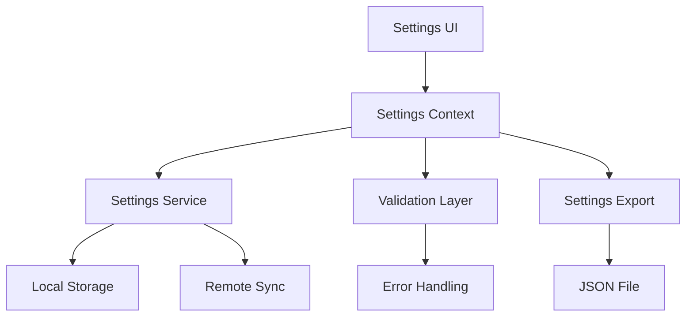

# Global Settings Page Design Document

## Overview
The global settings page provides a centralized interface for managing application-wide configurations, including AI providers, appearance, project defaults, and system preferences. The design focuses on clarity, accessibility, and efficient organization of settings.

## Design Goals
1. Provide intuitive access to all global configuration options
2. Maintain consistent state across sessions
3. Offer real-time validation and feedback
4. Support keyboard navigation and accessibility
5. Enable import/export of settings
6. Provide clear documentation for each setting

## UI Components

### 1. Navigation
- **Sidebar Categories**
  - General
  - AI Configuration
  - Appearance
  - Project Defaults
  - Privacy & Security
  - Advanced
  - About

### 2. Settings Sections

#### General Settings
- Language selection
- Auto-save interval
- Default file locations
- Update preferences
- Usage analytics opt-in

#### AI Configuration
- Provider selection and setup
  - Ollama configuration
  - OpenAI API settings
  - Anthropic API settings
- Model preferences
- Request parameters
  - Max tokens
  - Temperature
  - Top P
- Usage limits and quotas
- Caching preferences

#### Appearance
- Theme selection
  - Light/Dark/System
  - Custom theme support
- Font settings
  - Editor font
  - UI font
  - Font size
- Layout customization
  - Sidebar position
  - Panel arrangements
- Color customization
  - Accent color
  - Syntax highlighting

#### Project Defaults
- Template selection
- Default frameworks
- Code style preferences
- File organization
- Git integration settings

#### Privacy & Security
- Data collection preferences
- API key management
- Backup settings
- Local storage management

#### Advanced
- Developer tools
- Performance settings
- Debug options
- Export/Import settings

## Technical Implementation

### 1. State Management
```typescript
interface GlobalSettings {
  general: {
    language: string;
    autoSaveInterval: number;
    defaultLocation: string;
    checkUpdates: boolean;
    analyticsEnabled: boolean;
  };
  ai: {
    defaultProvider: string;
    providers: {
      [key: string]: AIProviderConfig;
    };
    modelPreferences: {
      [key: string]: ModelConfig;
    };
    requestDefaults: RequestConfig;
    usageLimits: UsageLimits;
  };
  appearance: {
    theme: 'light' | 'dark' | 'system';
    customTheme?: ThemeConfig;
    font: FontSettings;
    layout: LayoutConfig;
    colors: ColorConfig;
  };
  projects: {
    defaultTemplate: string;
    frameworks: string[];
    codeStyle: CodeStyleConfig;
    gitConfig: GitConfig;
  };
  privacy: {
    dataCollection: boolean;
    backupEnabled: boolean;
    storageQuota: number;
  };
  advanced: {
    developerMode: boolean;
    performanceMode: boolean;
    debugLevel: 'none' | 'error' | 'warn' | 'info' | 'debug';
  };
}
```

### 2. Components Structure
```
settings/
├── SettingsLayout.tsx
├── SettingsSidebar.tsx
├── sections/
│   ├── GeneralSettings.tsx
│   ├── AISettings.tsx
│   ├── AppearanceSettings.tsx
│   ├── ProjectSettings.tsx
│   ├── PrivacySettings.tsx
│   └── AdvancedSettings.tsx
├── components/
│   ├── SettingsCard.tsx
│   ├── SettingsSection.tsx
│   ├── SettingsForm.tsx
│   └── SettingsControls.tsx
└── hooks/
    ├── useSettings.ts
    └── useSettingsValidation.ts
```

### 3. Implementation Plan

#### Phase 1: Core Infrastructure
1. Create settings context and provider
2. Implement settings storage service
3. Build basic settings UI components
4. Add settings validation logic

#### Phase 2: Section Implementation
1. General Settings
   - Basic configuration options
   - Language support
   - Auto-save functionality

2. AI Configuration
   - Provider management
   - Model configuration
   - Usage tracking

3. Appearance Settings
   - Theme system
   - Font management
   - Layout customization

4. Project Defaults
   - Template system
   - Framework configuration
   - Code style settings

#### Phase 3: Advanced Features
1. Privacy & Security
   - API key encryption
   - Data management
   - Backup system

2. Advanced Settings
   - Developer tools
   - Performance optimization
   - Debug capabilities

#### Phase 4: Polish & Integration
1. Keyboard navigation
2. Accessibility improvements
3. Settings import/export
4. Migration system

## Data Flow



## API Design

### Settings Context
```typescript
interface SettingsContextType {
  settings: GlobalSettings;
  updateSettings: (section: keyof GlobalSettings, values: Partial<GlobalSettings[keyof GlobalSettings]>) => Promise<void>;
  resetSettings: (section?: keyof GlobalSettings) => Promise<void>;
  exportSettings: () => Promise<string>;
  importSettings: (json: string) => Promise<void>;
  validateSettings: (section: keyof GlobalSettings) => Promise<ValidationResult>;
}
```

### Settings Service
```typescript
interface SettingsService {
  load(): Promise<GlobalSettings>;
  save(settings: Partial<GlobalSettings>): Promise<void>;
  watch(callback: (settings: GlobalSettings) => void): () => void;
  validate(settings: Partial<GlobalSettings>): Promise<ValidationResult>;
  migrate(oldVersion: string, newVersion: string): Promise<void>;
}
```

## Security Considerations
1. Secure storage of API keys
2. Validation of imported settings
3. Rate limiting for settings changes
4. Audit logging of critical changes
5. Encryption of sensitive data

## Testing Strategy
1. Unit tests for individual settings components
2. Integration tests for settings service
3. E2E tests for settings flow
4. Migration tests
5. Security testing
6. Performance testing

## Performance Considerations
1. Lazy loading of settings sections
2. Efficient storage and retrieval
3. Debounced save operations
4. Optimized validation
5. Cached computations

## Accessibility
1. ARIA labels and roles
2. Keyboard navigation
3. High contrast support
4. Screen reader optimization
5. Focus management

## Future Enhancements
1. Cloud sync of settings
2. Settings profiles
3. Team settings management
4. Settings analytics
5. Advanced customization options

## Documentation Requirements
1. User guide for each setting
2. Technical documentation
3. API documentation
4. Migration guides
5. Security guidelines

## Success Metrics
1. Settings load time
2. Settings save success rate
3. User engagement with settings
4. Error rates
5. User satisfaction

## Timeline
1. Phase 1: 1 week
2. Phase 2: 2 weeks
3. Phase 3: 1 week
4. Phase 4: 1 week
Total: 5 weeks
